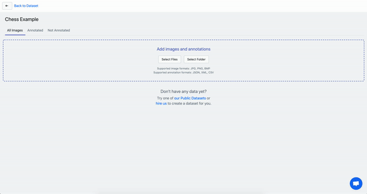
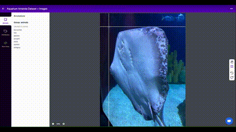
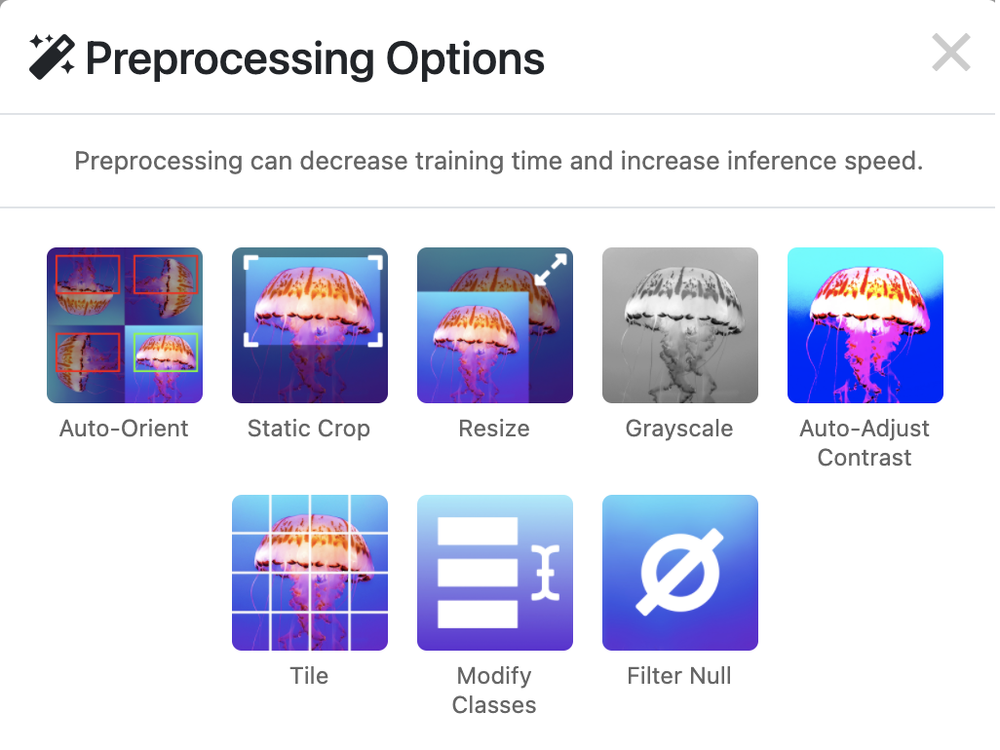
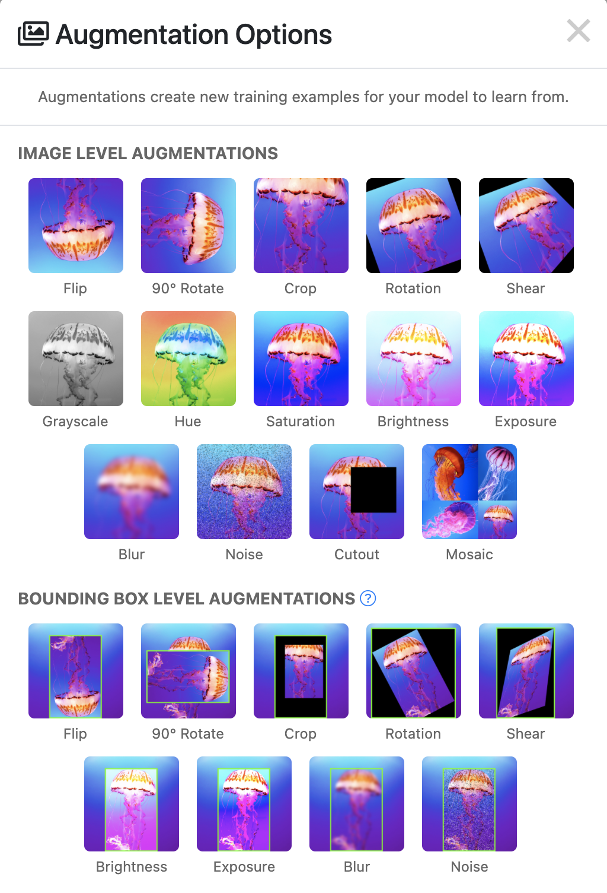
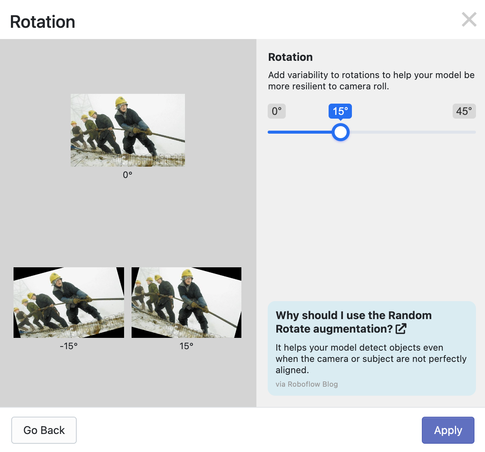

# Roboflow

Roboflow aims to democratize computer vision by streamlining the computer vision process from end to end. Rather than spending your time and energy wrangling annotation formats, writing scripts to preprocess your images, or learning how to code, **we empower you to focus on your problem**. Our goal is to give you everything you need to solve computer vision problems -- you just need to bring the images.

Roboflow allows you to [upload](#Upload), [annotate](#Annotate), [organize](#Organize), [train](#Train), and [deploy](#Deploy) with ease. Roboflow has been used to:
- [improve breast cancer research](https://blog.roboflow.com/cancer-research-computer-vision/),
- [identify letters signed in American Sign Language](https://blog.roboflow.com/computer-vision-american-sign-language/) in near-real-time,
- [detect when packages are delivered](https://blog.roboflow.com/using-computer-vision-to-detect-package-deliveries/),
- [protect endangered species](https://blog.roboflow.com/how-this-fulbright-scholar-is-using-computer-vision-to/),
[and more](https://blog.roboflow.com/tag/case-studies/).

[Let's get started](http://app.roboflow.com/)!

## Upload
The first step is to upload images or videos. [Roboflow's Web UI](https://docs.roboflow.com/adding-data) lets you effortlessly upload your images. It's as simple as dragging and dropping.

  

#### What if I have annotations?
- If you have annotations, you can upload those by dragging and dropping along with your images! We [support most annotation formats](https://roboflow.com/formats), including COCO JSON, Pascal VOC XML, Tensorflow TFRecord,  SuperAnnotate, YOLO Darknet, Google Cloud, and more. If you find that we don't support yours, let us know!
- If you don't have annotations, no worries! You can [annotate directly in our platform](#Annotate).

#### What if I have videos?
You can drag and drop videos in the same way. Roboflow will extract individual images from the video. You get to decide how frequently you want to sample images -- as frequently as 60 frames per second and as infrequently as 1 frame per 60 seconds. This is a [Roboflow Pro feature](https://roboflow.com/pro); reach out to us to get set up with that.

#### Are there other methods of uploading data?
Yes! We encourage everyone to use the Web UI, as this has maximal functionality. We also have [an Upload API](https://docs.roboflow.com/adding-data/upload-api) if you choose. We make [available public datasets](http://public.roboflow.com/), in case you want to play around with an existing dataset or use one to augment your own data.

## Annotate
Once you upload your images (or sample images from your video), you're ready to annotate. You can [annotate directly in our platform](https://docs.roboflow.com/annotate)!

  

You can annotate images upon upload, but you don't have to! We recommend the following workflow:
- Annotate as many images as you reasonably can on upload, then be sure to hit "Finish Upload" when you're done. You don't have to do all of them right now! However, don't annotate some and walk away without finishing your upload -- you don't want your upload to time out.
- Once you finish the upload, you'll be able to continue adding annotations to images. Just click on the images and upload.
- If you're collaborating with a team, consider uploading the images separately, annotating them independently, [sharing your images with your team](https://blog.roboflow.com/teams-for-all/), and merging the datasets.
- We've even launched model-assisted labeling -- so once you build a good enough model (or find a good enough public model!) you can get that model to auto-label for you. _We're really excited about this_.

## Organize
One of the most time-consuming aspects to computer vision problems is organizing your images. Whether it's [ensuring your data's quality](https://docs.roboflow.com/dataset-health-check) or [preprocessing your images](https://docs.roboflow.com/image-transformations/image-preprocessing), there's often custom code and coordination that needs to happen. Each piece of custom code or handoff from one to another increases the possibility of bottlenecks and mistakes. Roboflow is designed to remove as many of these barriers as possible.

There are also steps that are important to keep in mind, like splitting data into [training, validation, and testing sets](https://blog.roboflow.com/train-test-split/) or [identifying imbalanced classes that require attention](https://blog.roboflow.com/handling-unbalanced-classes/). If your team isn't formally trained in data science, these may be easy steps to accidentally skip! Roboflow is set up to ensure important steps like these aren't skipped.

- Roboflow's [image preprocessing](https://docs.roboflow.com/image-transformations/image-preprocessing) steps prepare your images for modeling and can reduce the time it takes to build your model and increase your model's overall performance.

  

- Roboflow's [image augmentation](https://docs.roboflow.com/image-transformations/image-augmentation) steps are designed to improve your model's ability to generalize well to unseen images.

  

Each preprocessing and augmentation technique can be included in a couple of clicks, and most have guidance to help you understand when you might want to apply that technique.

  

## Train
At this point, we'd like to train a model! [Roboflow Train](https://docs.roboflow.com/train) is our one-click [AutoML](https://en.wikipedia.org/wiki/Automated_machine_learning) service -- just click one button and kick things off!
- You can start from scratch, which is the way most people build models. You take your data and pass it into a deep learning model.
- If you have an existing model that you'd like to improve with new data, you can also start from a checkpoint. This way, you get to leverage your old model's performance.

Check out [Roboflow's Model Zoo](https://models.roboflow.com/) for the types of models we have. Included are free tutorials and notebooks, so if you want to train a model to your own specifications, we give you that flexibility. You will be able to export your images in whatever format you need for the particular model you want.

## Deploy
Once you've built a model, you can deploy your solution nearly anywhere you want.
- Do you want to use our [Inference API](http://infer.roboflow.com/)?
- Deploy to your [iPhone? _Note: this is a video link_.](https://www.youtube.com/watch?v=kBn7Cd8Z8yE&feature=emb_title)
- Deploy to an [OAK-D](https://blog.roboflow.com/luxonis-oak-d-custom-model/) or a [Jetson NX](https://blog.roboflow.com/deploy-yolov5-to-jetson-nx/)?
- Something else? Check out the [Roboflow blog](https://blog.roboflow.com/) to see a variety of deployment-related , or reach out!

## That's it!
Roboflow is designed with you, the user, in mind.

Roboflow came about because our cofounders, Joseph Nelson and Brad Dwyer, participated in a hackathon in which they wanted to develop an AR app that could augment the game of chess. Rather than spending 48 hours on creatively tackling this problem, they found that the vast majority of their time was doing data preparation. They recognized this as a pattern -- they had experienced this in other CV problems they had attempted in the past. Rather than reinventing the wheel, they set out to solve this problem so that when they and others tackled computer vision problems in the future, they could invest their time in solving that problem.

**We empower you to focus on your problem**.
